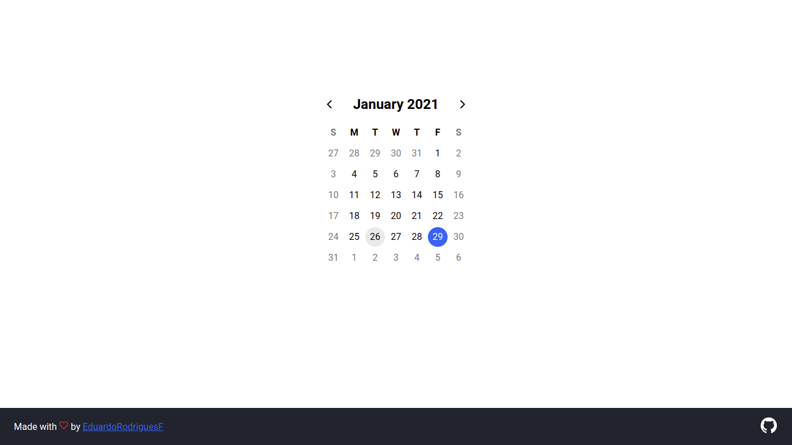
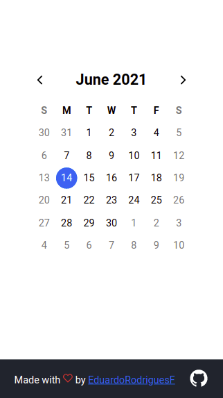

# Calendar with ReactJS

## 💡 About

This is a small training and challenge I made for myself to learn how to work with the (sometimes complicated) JavaScript dates system.
For now, it just shows you dates by month and allows you to select a date and highlight it.

## 👁️ Preview

<div align="center">
  
  
</div>

## 🏃 Milestones 

- [x] Display month days in correct order
- [x] Change current month view
- [x] Select specific date
- [x] Keep date selected when changing months and not misselect in another month
- [ ] Create events in dates
## ⚙️ Technologies

- TypeScript
- ReactJS
- Redux
- Styled Components
- React Icons
- ESLint, Prettier
- Jest

## Usage

1. Clone the repository in your desired folder either by clicking on <code>Code</code> above and downloading ZIP file or by command:
```bash
$ git clone https://github.com/EduardoRodriguesF/calendar.git
```

2. Go into the folder:
```bash
$ cd calendar
```

3. Install dependencies:
```bash
$ yarn
# or
$ npm install
```

4. Execute <code>start</code> command:
```bash
$ yarn start
# or
$ npm start
```

5. Open <a href="http://localhost:3000">localhost</a> at port 3000

## License
THis project is under <a href="https://github.com/EduardoRodriguesF/calendar/blob/main/LICENSE">MIT license</a>.